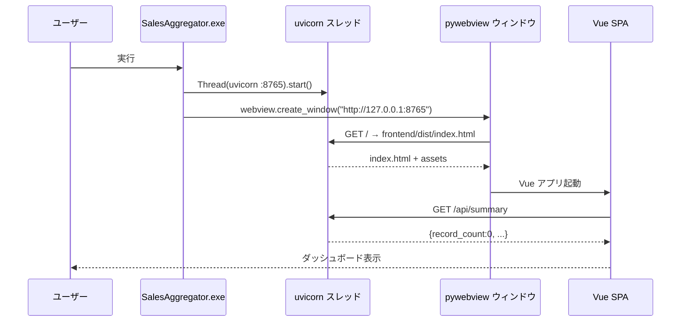
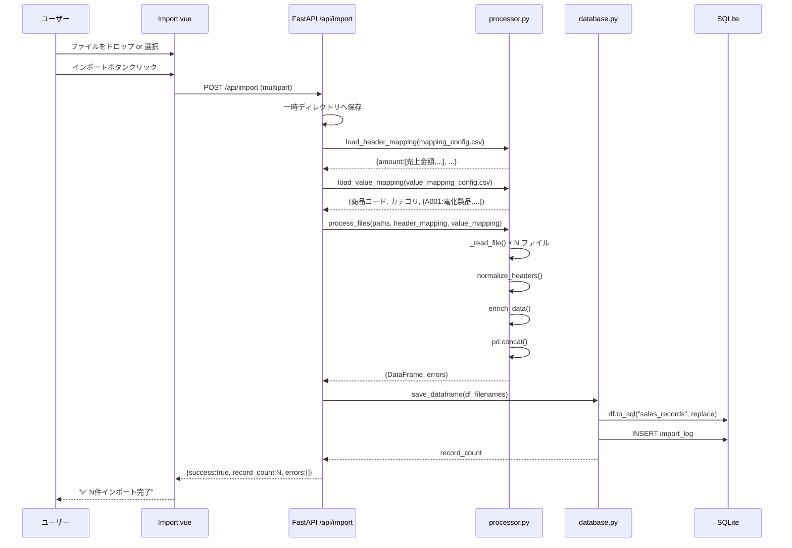
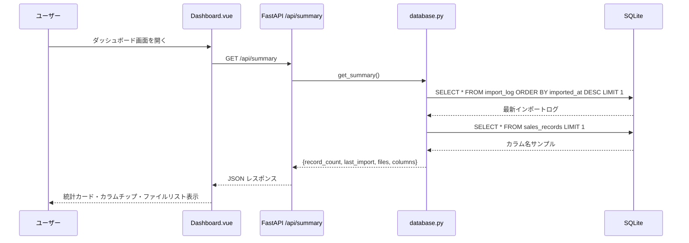
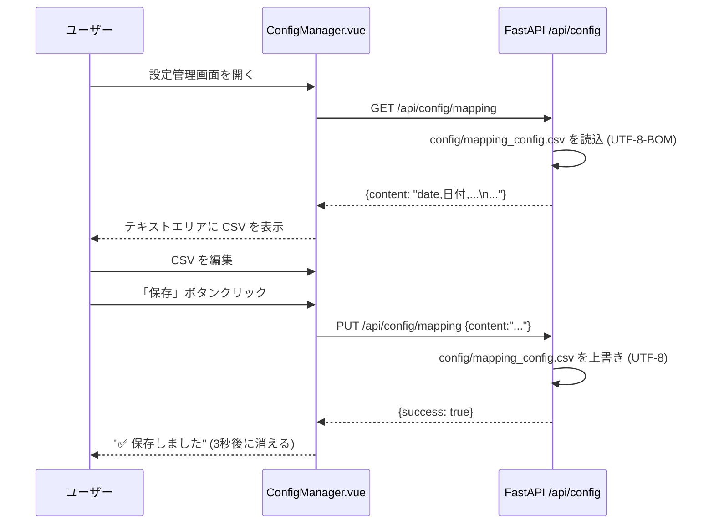
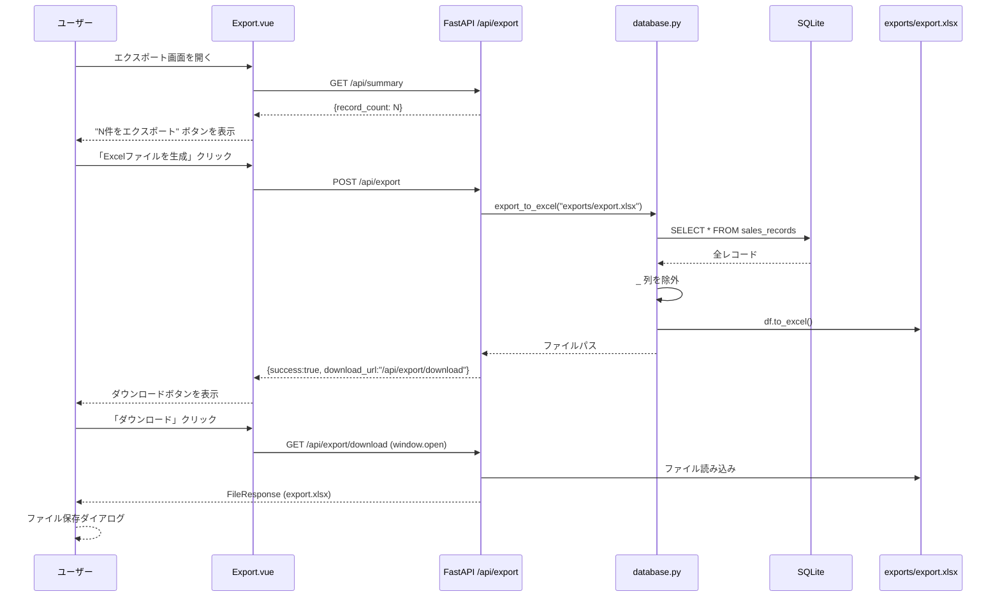

# 売上集計アプリケーション 設計書

## 1. システム概要

複数の売上ファイル（CSV / Excel）を読み込み、列名を正規化してマスタ照合を行い、SQLite に蓄積して Excel 出力するデスクトップ業務アプリ。

- **フロントエンド**: Vue 3 SPA（Vite + Tailwind CSS）
- **バックエンド**: Python FastAPI（uvicorn で起動）
- **デスクトップ**: pywebview でウィンドウ表示（本番）
- **DB**: SQLite（sqlalchemy + pandas）
- **パッケージング**: PyInstaller（.exe 単体配布）

---

## 2. ディレクトリ構成

```
uriageAggre/
├── backend/
│   ├── __init__.py
│   ├── processor.py    # ETL: 読込 / 正規化 / エンリッチメント
│   ├── database.py     # DB 操作: 保存 / 取得 / エクスポート
│   └── main.py         # FastAPI アプリ + pywebview 起動
├── frontend/
│   ├── package.json
│   ├── vite.config.js  # 開発プロキシ (/api → :8765)
│   └── src/
│       ├── App.vue           # レイアウト（サイドバー + RouterView）
│       ├── router/index.js   # ハッシュヒストリー 4 ルート
│       ├── api/index.js      # Axios ラッパー
│       └── views/
│           ├── Dashboard.vue     # サマリー表示
│           ├── Import.vue        # ファイルアップロード
│           ├── ConfigManager.vue # 設定 CSV 編集
│           └── Export.vue        # Excel 出力
├── config/
│   ├── mapping_config.csv       # 列名マッピング定義
│   └── value_mapping_config.csv # マスタ照合定義
├── tests/
│   ├── conftest.py
│   ├── test_processor.py  (20 テスト)
│   ├── test_database.py   (6 テスト)
│   └── test_api.py        (8 テスト)
├── sales_data/
│   └── sample.csv         # サンプルデータ
├── build.spec  # PyInstaller 設定
├── build.py    # ビルドスクリプト
├── debug.bat   # 開発起動スクリプト
└── start.bat   # 本番起動スクリプト（pywebview）
```

---

## 3. コンポーネント間関係

```
┌─────────────────────────────────────────────────────┐
│  pywebview (デスクトップウィンドウ)                    │
│  ┌───────────────────────────────────────────────┐   │
│  │  Vue 3 SPA  http://127.0.0.1:8765             │   │
│  │  Dashboard / Import / Config / Export          │   │
│  └───────────────┬───────────────────────────────┘   │
│                  │ HTTP /api/*                        │
│  ┌───────────────▼───────────────────────────────┐   │
│  │  FastAPI (uvicorn :8765)                       │   │
│  │  ┌──────────────┐  ┌──────────────────────┐   │   │
│  │  │ processor.py │  │ database.py           │   │   │
│  │  │ ETL Pipeline │  │ SQLite / Excel        │   │   │
│  │  └──────────────┘  └──────────────────────┘   │   │
│  └───────────────────────────────────────────────┘   │
│                  │                                    │
│  ┌───────────────▼─────────┐                         │
│  │  sales_data.db (SQLite) │                         │
│  └─────────────────────────┘                         │
└─────────────────────────────────────────────────────┘
```

---

## 4. データベーステーブル

### sales_records（動的スキーマ）

インポートのたびに DROP → CREATE → INSERT される。列名はインポートファイルの正規化後の列に依存する。

| 列名 | 型 | 備考 |
|---|---|---|
| date | TEXT | 正規化後の日付列 |
| amount | REAL | 正規化後の金額列 |
| client | TEXT | 正規化後の取引先列 |
| product_code | TEXT | 正規化後の商品コード列 |
| _source_file | TEXT | 元ファイル名（エクスポート除外） |
| ※ 任意の列 | - | ファイル内容により変動 |

### import_log

| 列名 | 型 | 備考 |
|---|---|---|
| id | INTEGER PK | 自動採番 |
| files | TEXT | JSON 配列（ファイル名リスト） |
| record_count | INTEGER | 取込件数 |
| imported_at | DATETIME | UTC タイムスタンプ |

---

## 5. 設定ファイル仕様

### config/mapping_config.csv

列名の正規化ルールを定義する。

```
フォーマット: 正規名,別名1,別名2,...
例:
  amount,金額,Amount,売上金額,revenue,売上
  date,日付,Date,transaction_date,売上日
```

### config/value_mapping_config.csv

マスタ照合ルールを定義する。

```
フォーマット:
  1行目: キー列名,追加列名        ← ヘッダー
  2行目以降: キー値,マッピング値  ← データ

例:
  商品コード,カテゴリ
  A001,電化製品
  B001,食品
```

---

## 6. ETL パイプライン詳細

```
ファイル群
  │
  ▼  _read_file()
  DataFrame（生データ）
  │  エンコーディング試行順: UTF-8-BOM → CP932 → UTF-8
  │
  ▼  normalize_headers()
  DataFrame（列名正規化済）
  │  マッピングに一致した列名を正規名に変換
  │  例: "売上金額" → "amount"
  │
  ▼  enrich_data()        ※ value_mapping_config.csv がある場合のみ
  DataFrame（マスタ列追加済）
  │  key_col の値でマスタ辞書を引いて new_col を追加
  │  未一致は "N/A"
  │
  ▼  "_source_file" 列追加
  DataFrame（完成）
  │
  ▼  pd.concat()（複数ファイルの場合）
  結合 DataFrame
  │
  ▼  save_dataframe()
  SQLite (sales_records)
```

---

## 7. API エンドポイント一覧

| メソッド | パス | 説明 |
|---|---|---|
| GET | /api/summary | ダッシュボード用サマリー |
| POST | /api/import | ファイルアップロード＆ETL実行 |
| GET | /api/data | ページネーション付きレコード取得 |
| GET | /api/config/{type} | 設定CSV取得（mapping / value_mapping） |
| PUT | /api/config/{type} | 設定CSV上書き保存 |
| POST | /api/export | Excel生成（exports/export.xlsx） |
| GET | /api/export/download | 生成済みExcelダウンロード |

---

## 8. シーケンス図

### 8-1. アプリケーション起動（pywebview モード）



### 8-2. ファイルインポート



### 8-3. ダッシュボード表示



### 8-4. 設定管理（読み込み＆保存）



### 8-5. Excel エクスポート＆ダウンロード



---

## 9. テスト構成

| ファイル | 対象 | テスト数 |
|---|---|---|
| tests/test_processor.py | ETL ロジック (normalize_headers, enrich_data, loaders, process_files) | 20 |
| tests/test_database.py | DB 操作 (save/get/export) | 6 |
| tests/test_api.py | FastAPI エンドポイント (E2E) | 8 |
| **合計** | | **34** |

テスト実行: `pytest tests/ -v`

---

## 10. ビルド & 配布

```
開発環境:
  uvicorn backend.main:app --reload --port 8765
  cd frontend && npm run dev

本番ビルド:
  pip install pyinstaller
  python build.py
  → dist/SalesAggregator/SalesAggregator.exe

配布物:
  dist/SalesAggregator/ フォルダ全体を zip して配布
  ※ config/ フォルダをユーザーが編集できるよう .exe と同階層に置くこと
```
